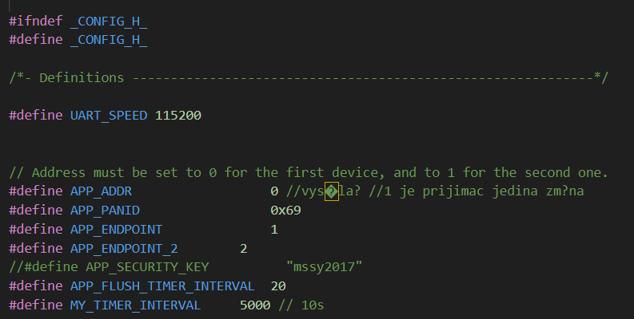
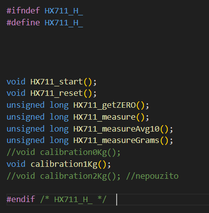
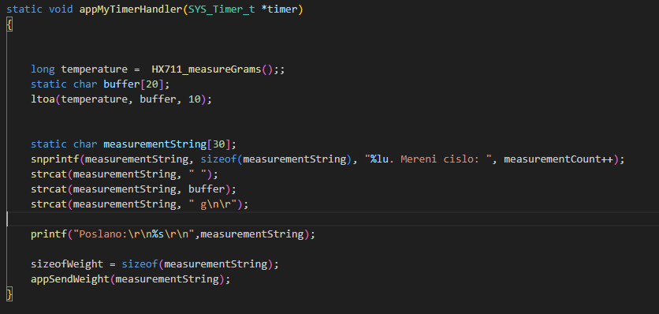
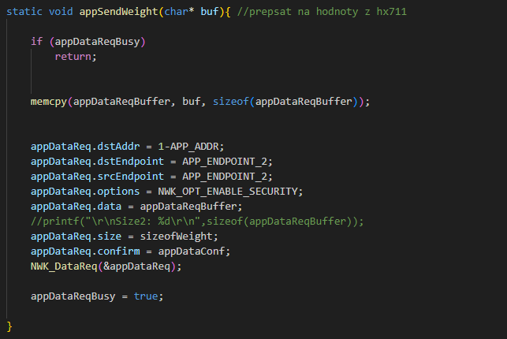
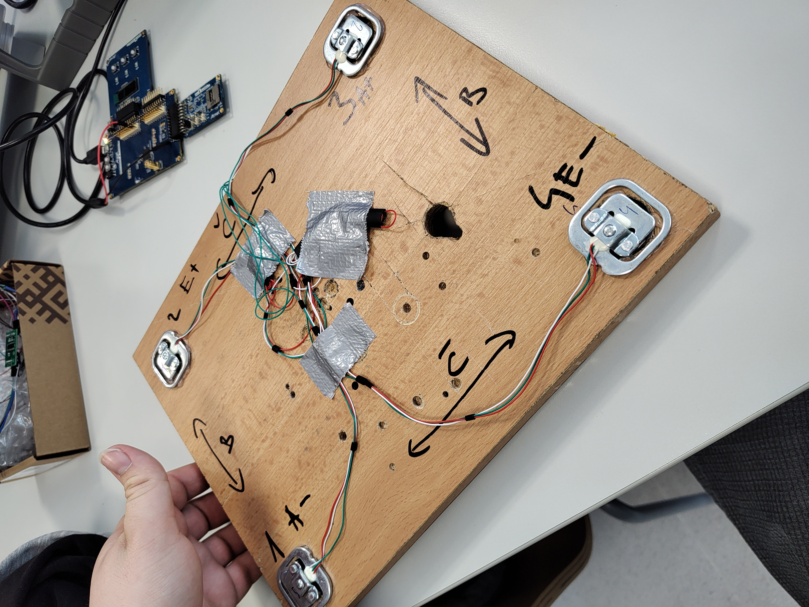
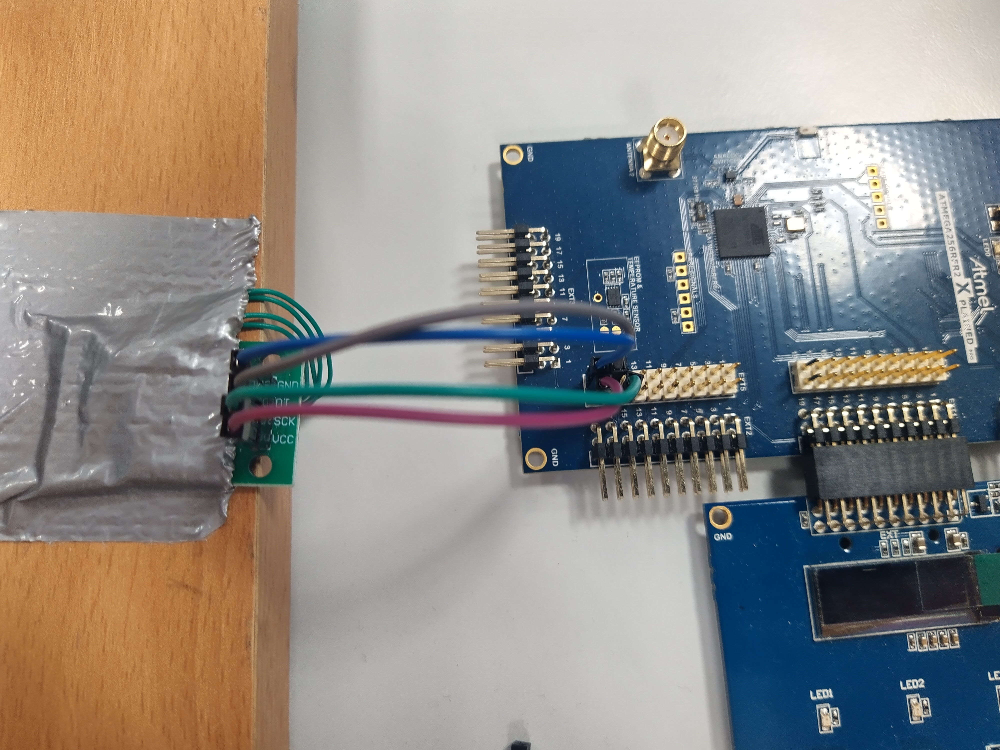

*This project was developed as an assignment for the ssy class at BUT FEEC University. (https://www.fekt.vut.cz/en/home)*

# SSY-HX711_LWM

Creation of school project, with HX711 sensor, ATmega256RFR2 in C library which allows user to measure weight and send it via uart and lwm network. Task was to use controller, connect HX711 and load cells (used 4 load cells). I took first inspiration for using HX711 from its datasheet and from [5].

### Assignment:

-Study datasheet of HX 711 https://cdn.sparkfun.com/datasheets/Sensors/ForceFlex/hx711_english.pdf

-Implement function for reading weights in C code by datasheet (example)

-Design connection of load cells and use 1 or 2 axis. 

## Solution:

## 1. Improving existing LWM code from lecture
First step in my project was to take and improve existing code from lecture, for LightWeight Mesh network. I let older files like i2c librabry, ad converter library and also at30tse758 in code for future improvements or just for testing. Main file for LWM is config.h, which consists lwm network code. In this file you **need to set up values of APP_ADDR and APP_PANID** APP_ADDR is choosing it the code is working as sender or receiver, 1 is receiver and app_panid is unique ID in lwm network, you need to set up same for sender and receiver. **Also make sure to set up value of My_interval value for the time you want to send data** in sender code. 

Part of code you can see briefly in picture below.

## 2.Creating HX711 library
Second step in project was to create library which will allow to measure and read data from HX711 with load cells connected. Firstly i created HX711.h which is prescription of the library and its consists of functions (voids) i want to use. 

Then we will voids in .c main library file. Let me briefly explain functions and what they do. 
1. Firstly we define variables which we will be using. 

2. HX711_start 
is only basic function which makes inicilization of the HX711 connected via ADC. Inside is endless cycle, in which there are sumcount variable which measures and countes values (adc values) get from HX711_measure function. And measures until there are 25 measurements, then average value is counted from those 25 measurements and this value is used to set HX711_ZERO which is basically basic value for AD converted which is then used to convert it to real weight - its analog value which represents 0 Kg (if the weight plane is without objects). 

3. HX711_measure
In this function is cycle which waits until signal is detected on PINB3 (data pin of the HX711) which means weight is connected and starts sending via HX711. Then we use cyclus that reads values from HX711 for 24bits (output from HX711 is in 24b in the bimetal complements and starts with MSB). PINB2 is set to high for clock for HX711 and there is small delay for proper functioning. In the following happens this: count = count<<1;: Shifts the current data one position to the left, cbi(PORTB,2);: Sets the pin to a low level (turns off the clock signal), if(tbi(PINB,3)) count++;: If a high signal is detected on the data pin, increments the count variable. After that clock signal is ended by setting HIGH to clock pin. 

4. HX711_measureAVG10
This function performs averaging of values obtained by measuring with HX711.
It initializes variables pocet and sumCount to 0.
In an infinite loop, it continuously performs measurements and adds the measured values to sumCount.
After ten measurements, it calculates the average value HX711_averageCount and returns it.
It resets the variables and prints out the average value of zero weight.

5. HX711_measureGrams
This function calls the HX711_measureAvg10 function to perform ten measurements and obtain the average value.
It compares the average value with the zero value and calculates the weight in grams based on the difference.
If the calibration is non-zero, the corrected calibration value is used.
It returns the calculated weight and prints it out.
Both functions are used for weighing and obtaining weight based on the measured data from HX711. The HX711_measureGrams function utilizes the HX711_measureAvg10 function to obtain the average value.

## 2.1 Improving LWM code for sending measured data
In the main.c function were added pullups for handling buttons which we will describe later. There is initiation of the HX711 functions which allows to process data measured and send it via LWM and UART. Mani void is handled by own interval which we set timer in config.h to 5 seconds. It calls HX711_measureGrams which return value in grams, then sends it via UART and LWM network. This void we can see in picture below.

Part for sending via LWM can be seen in picture below.

## 3.Connecting together
In picture this picture you can see load cells connected to HX711. 

HX711 is connected to ATMega on EXT5, VCC on pin 19 also GND right next to it, SCK on pin 15, pin 17 is used for STD (data pin)

## 4.How to use
Bla bla bla

# References:
[1][Datasheet](https://ww1.microchip.com/downloads/en/DeviceDoc/Atmel-8393-MCU_Wireless-ATmega256RFR2-ATmega128RFR2-ATmega64RFR2_Datasheet.pdf)

[2][HX711sensor](https://cdn.sparkfun.com/datasheets/Sensors/ForceFlex/hx711_english.pdf)

[3][University](https://www.fekt.vut.cz/en/home)

[4][LWM guide](https://ww1.microchip.com/downloads/en/Appnotes/Atmel-42028-Lightweight-Mesh-Developer-Guide_Application-Note_AVR2130.pdf)

[5][Inspiration](https://github.com/bogde/HX711)
